# Parallax Interior Mapping for City-Scale OpenUSD Digital Twins

> Building scalable parallax interiors with OpenUSD and NVIDIA MDL

**Status**: MDL room, depth-slice, and UDIM-variation baselines validated •
Production integration in progress

---

## The Problem

Urban Digital Twins face a fundamental challenge: **realistic building interiors at scale**.

A single city block contains hundreds of windows. Each window reveals an
interior — furniture, wall art, lighting fixtures. At façade scale, direct
interior geometry creates a trade-off between scene detail, authoring effort,
and runtime budgets:

- **Full interior geometry**: Hundreds of visible rooms can require thousands
  of placed furniture and prop instances, even when the asset library is
  efficiently instanced.
- **Black windows**: Cheap to render, but visibly break immersion.
- **Reflection-only or curtain fallbacks**: Acceptable from a distance, but
  unconvincing at street level.

The rendering technique already exists. The research problem is carrying it
cleanly through an artist-facing OpenUSD and NVIDIA MDL workflow.

---

## The Solution: Parallax Interior Mapping

**Parallax Interior Mapping (PIM)** renders interiors into specialised textures,
then uses shader mathematics to create a convincing 3D illusion. It is a
well-established technique for producing view-dependent depth perception from
2D data.

**How it works:**

1. Bake an interior into a cross-shaped atlas containing the room faces and
   optional depth slices.
2. Precompute a local coordinate frame for each window.
3. Use the camera direction in the material to select the correct atlas region
   and create view-dependent parallax.

**The intended production result**: large numbers of visually varied virtual
interiors evaluated on existing window surfaces rather than modelled as full
interior geometry.

**The challenge**: Build an artist-facing PIM material that carries the required
room-frame and camera data through OpenUSD, then evaluates the illusion
efficiently in NVIDIA MDL.

---

## This Research: Parallax Interior Mapping in MDL/OpenUSD

**Goal**: Develop a native PIM material for NVIDIA MDL and OpenUSD, enabling
Omniverse-based Digital Twins to benefit from lightweight interior rendering.

**Why this matters:**

- **For Digital Twins**: Scalable urban interiors with reduced geometry and scene-complexity requirements
- **For NVIDIA**: Demonstrates MDL and OpenUSD capability for an advanced, artist-facing material workflow
- **For the industry**: Cross-DCC interoperability — workflows shouldn't be siloed by renderer choice

> [!NOTE]
> **On Technique vs. Implementation**
>
> **Parallax interior mapping** is a well-established rendering technique used across game engines (Unreal, Unity), shading languages (OSL, GLSL), and DCC tools. SideFX's Karma Room Map is an important VEX-based reference implementation, not the origin of the underlying algorithm.
>
> This research develops a native PIM implementation for MDL and OpenUSD. The SideFX workflow informs the reference geometry, frame-data, and atlas contracts; it is not copied or directly translated.
>
> Credit to SideFX for their excellent documentation and implementation, which serve as an important reference for this work.

---

## Visual Baseline and Transformation Path

This RnD begins with a digital replica of Building 150 on Moskovsky Avenue in
Saint Petersburg, prepared as a USD asset for Omniverse. As the screenshot
shows, its windows currently read as identical mirror-like polygons that do
little more than repeat the surrounding HDRI reflection across the facade. The
result is mechanically uniform: every opening responds in much the same way,
with no suggestion of the spaces or activity behind the glass.

The goal of this RnD is to create a native MDL Room Map material that breathes
life into the building. Replacing that repetitive mirrored surface with
view-dependent interiors visible behind the glazing should make the
transformation immediately legible: the same USD building begins to feel
occupied, varied, and alive without requiring every room to be modelled.

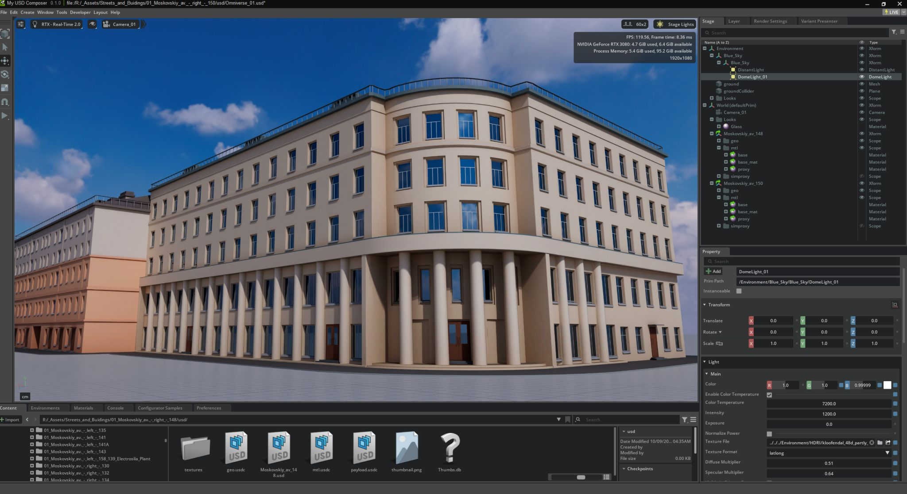

*Starting asset: the Omniverse USD building before room-frame data, MDL
parallax mapping, and interior variation are introduced.*

### First MDL Parallax Proof

The first functional MDL vertical slice uses a one-by-one test window to sample
a labelled cross-atlas and form a view-dependent virtual room. The diagnostic
texture makes every face assignment readable, while the applied material views
show how the visible walls change as the camera moves.

| Baseline test plane | Diagnostic cross-atlas |
| --- | --- |
| 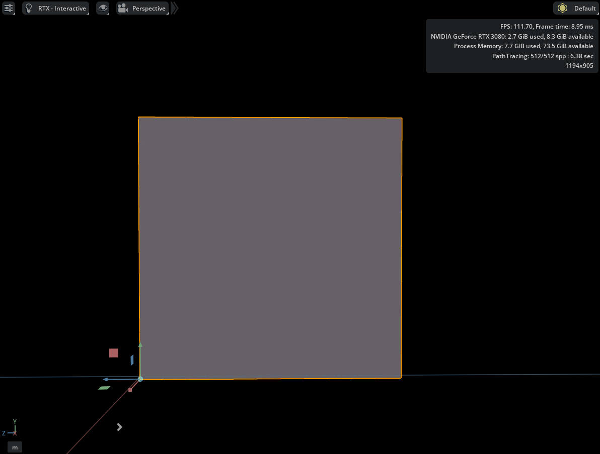 | 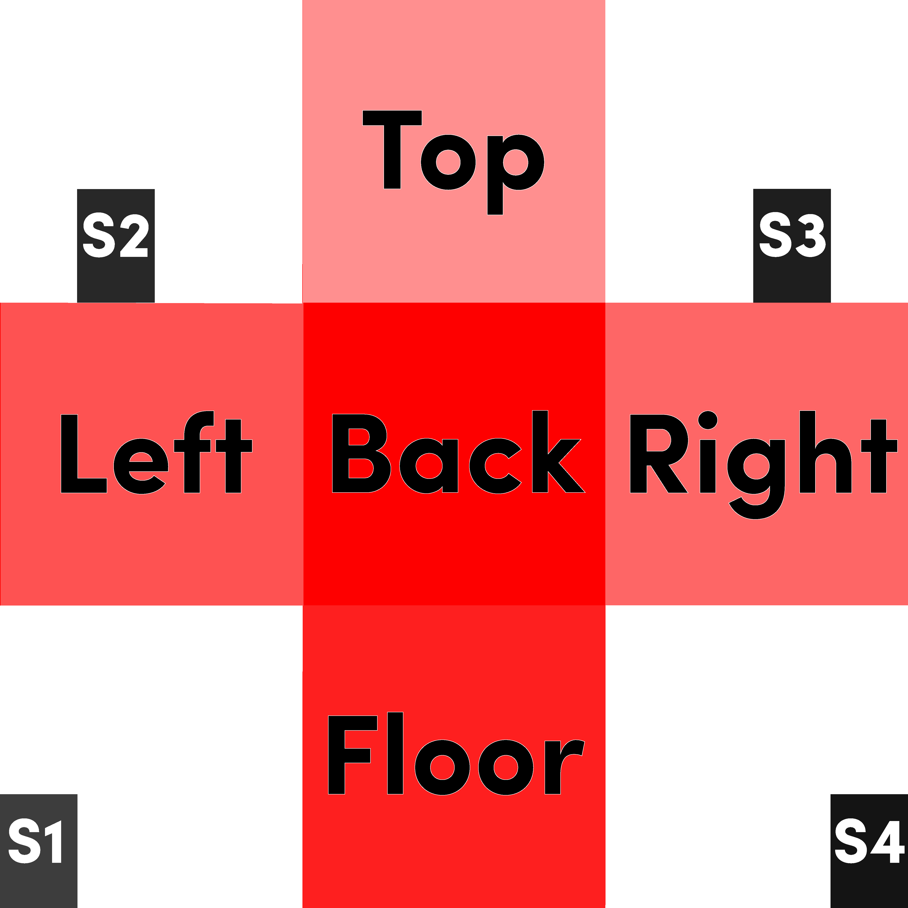 |

*The diagnostic cross-atlas defines the five virtual room faces. S1–S4 are
reserved depth-slice markers and are not sampled by this first vertical slice.*

| Head-on room view | Oblique room view |
| --- | --- |
| 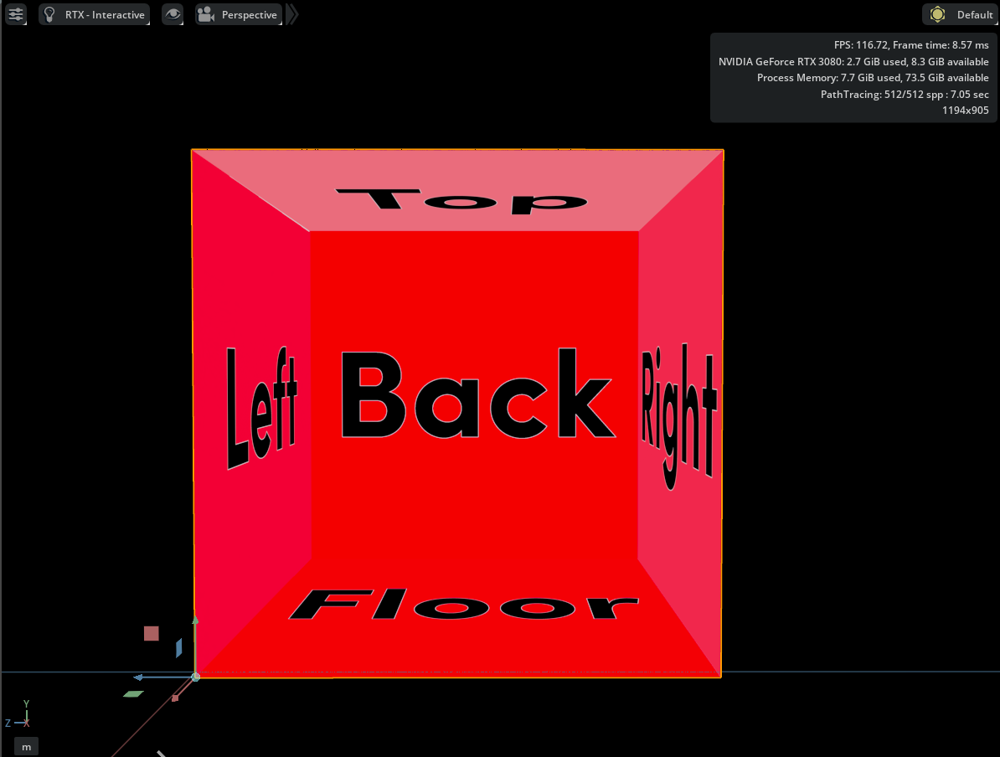 | 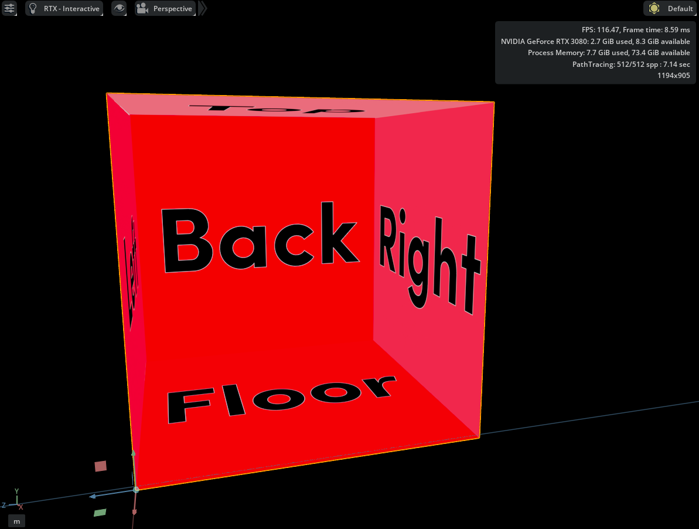 |

*The changing visible faces demonstrate the parallax response while the
labelled atlas exposes any incorrect face assignment or orientation.*

### MDL Depth-Slice Proof

The public `room_map` material extends the five-face room with four
alpha-composited virtual planes. The green diagnostic atlas separates this
validation from the red single-room baseline: S1–S4 are sampled from the four
corner regions and positioned by editable percentages of room depth.

| Depth-slice test room | Depth-slice diagnostic cross-atlas |
| --- | --- |
| 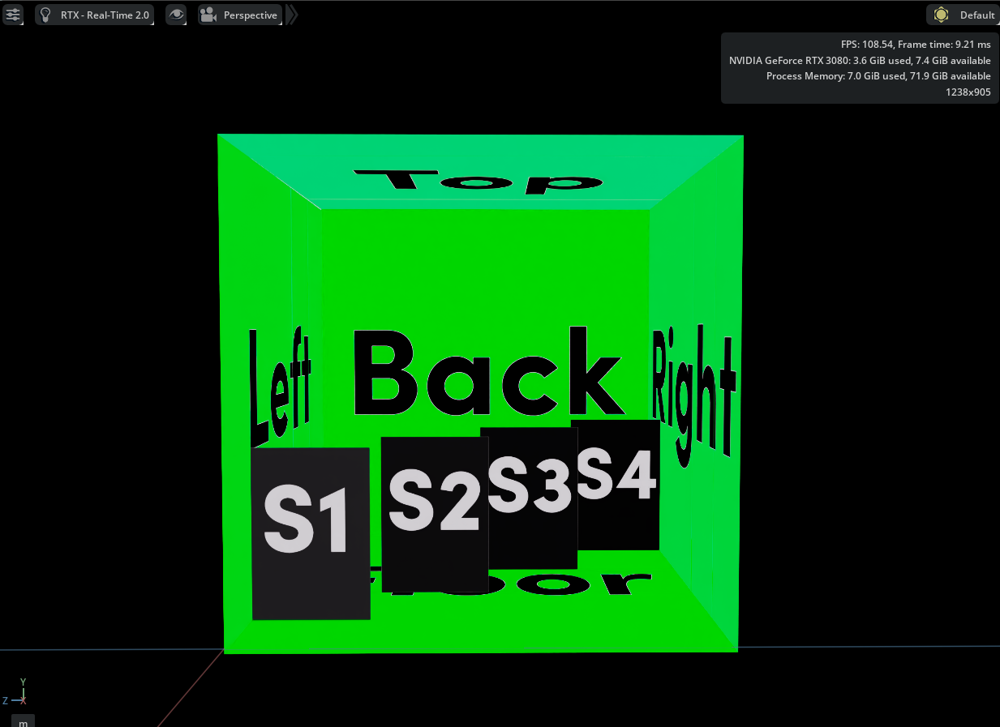 | 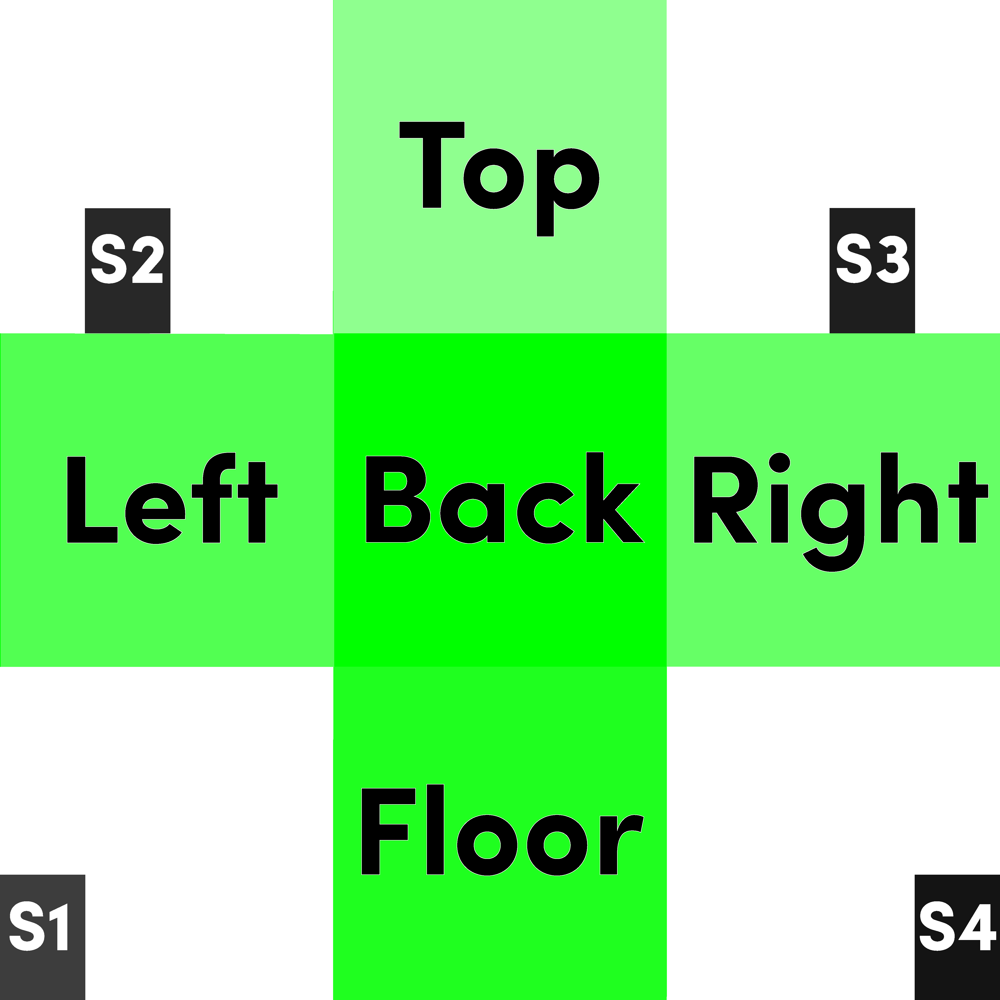 |

*The green cross-atlas retains the five room faces and uses its four corner
regions as alpha-capable S1–S4 slice tiles.*

| Oblique RTX Real-Time view | Oblique RTX Interactive (Path Tracing) view |
| --- | --- |
| 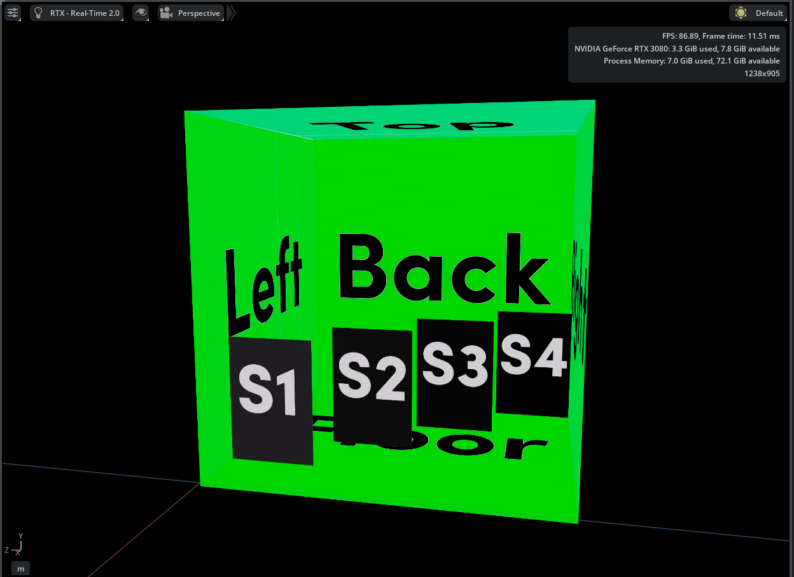 | 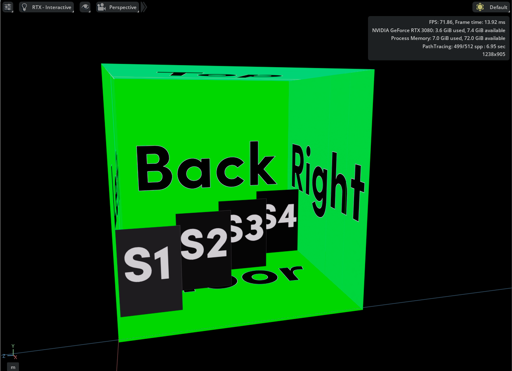 |

*The changing camera angle exposes the virtual depth planes. The material
sorts their alpha contribution by edited geometric depth, rather than by fixed
S1–S4 order.*

### Deterministic Room Variation Across Omniverse-Authored and DCC-Exported Geometry

The next stage stores three complete diagnostic interiors in one UDIM sequence
and selects them inside MDL from an integer `roomID` and material-level seed.
Disconnected windows carrying the same identifier retain the same green, red,
or blue room without requiring separate material bindings.

| Omniverse-authored test scene — RTX Real-Time | Omniverse-authored test scene — RTX Interactive |
| --- | --- |
| 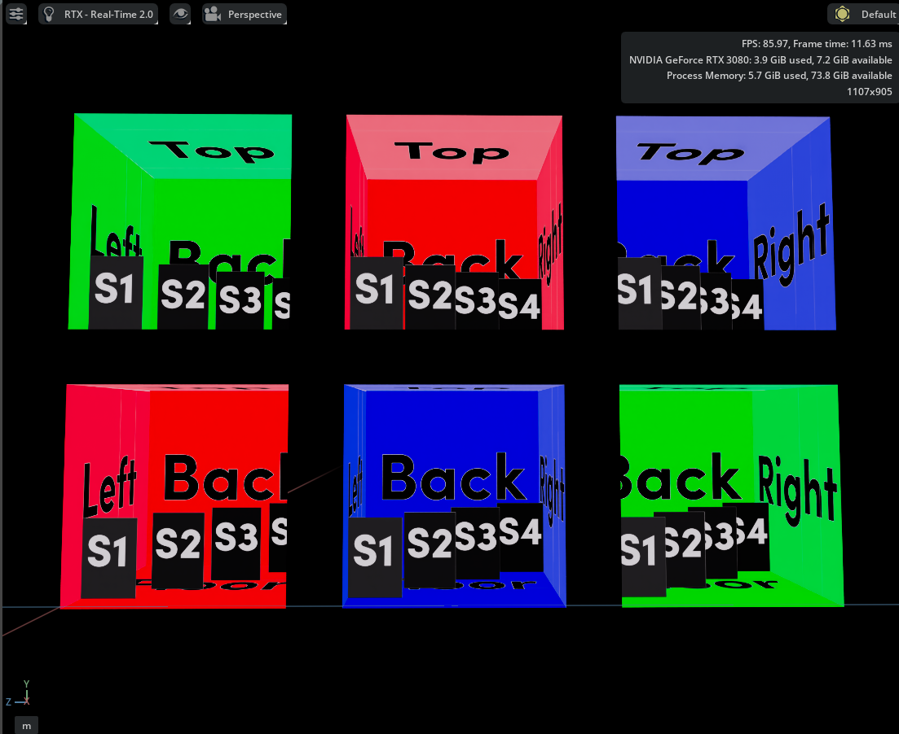 | 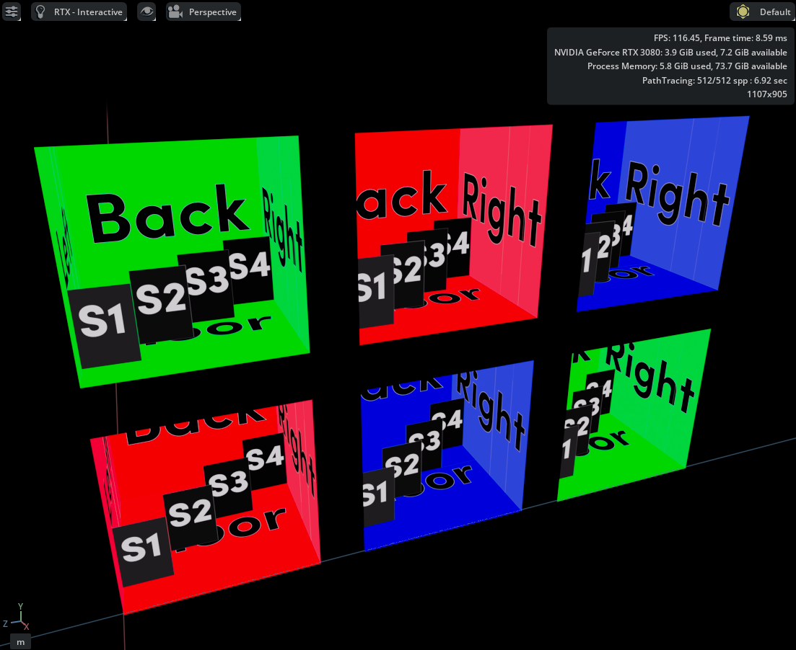 |

*The six grids created for the Omniverse test scene make repeated `roomID`
pairs directly comparable, while the labelled faces and S1–S4 slices expose
orientation or tile-selection errors.*

The second scene uses 15-window test geometry exported through a standard
OpenUSD workflow. Houdini is the specific DCC used for this retained asset and
procedurally authors a dedicated `roomUV` primvar. The model's ordinary UV
layout remains independent from the Room Map projection.

| DCC-exported test geometry — RTX Real-Time | DCC-exported test geometry — RTX Interactive |
| --- | --- |
| 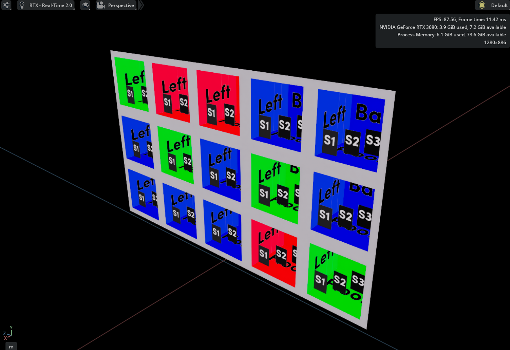 | 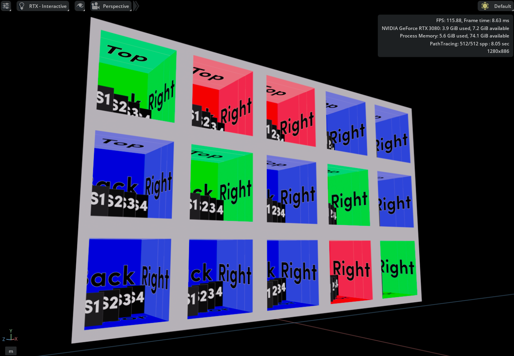 |

*The facade keeps its original material while one shared MDL material drives
all windows. Spatially separated windows with the same `roomID` remain
visually consistent in both RTX renderers.*

### Current Prototype Boundary

#### Validated now

- A common centred virtual-room scale across square `1 × 1`, landscape `2 × 1`,
  and portrait `1 × 2` windows in Omniverse-authored and Houdini-exported
  test assets.
- Five virtual room faces: Back, Left, Right, Ceiling, and Floor.
- Four alpha-composited virtual depth slices: S1, S2, S3, and S4.
- Named USD frame primvars: `roomP`, `tangentu`, and `tangentv`.
- Dedicated face-varying `roomUV` coordinates that do not replace the model's
  ordinary UV layout.
- Three deterministic UDIM room variants selected from `roomID` and
  `variation_seed` through one material binding.
- Active-camera runtime bridge and cross-atlas mapping.
- Editable uniform room scale plus aperture scale and offset controls.
- Editable per-slice enable, depth, offset, and scale controls.
- Correct face assignment, orientation, and depth sorting in RTX Real-Time and
  RTX Interactive (Path Tracing).

#### Not implemented yet

- Shared coherent room volumes across multiple or non-coplanar windows.
- Production glass integration.
- Full Building 150 façade integration.
- A geometry-versus-Room-Map performance benchmark.

---

## Technical Challenge: Native MDL/OpenUSD Implementation

The SideFX reference workflow and this native MDL/OpenUSD implementation meet
different geometry, material, and runtime constraints:

### 1. **Room Frame Data in MDL**

Houdini exports `roomP`, `tangentu`, and `tangentv` as named USD `float3`
primvars. The validated MDL material reads them with
`nvidia::support_definitions::data_lookup_float3()` and constructs the local
room frame from the exported data. A separate face-varying `roomUV` primvar
provides normalised window coordinates without replacing the model's ordinary
packed UV layout.

`nvidia::support_definitions` is an Omniverse-specific dependency of this
implementation. The named-primvar path has been visually validated in RTX
Real-Time and RTX Interactive (Path Tracing); the detailed evidence is in the
[primvar access diagnostic](docs/knowledge_base/mdl/004_primvar_access.md).

This named-primvar route is the current validated production contract. Dynamic
frame construction for environments without the NVIDIA support definitions
module remains a possible compatibility path, not a demonstrated capability.

---

### 2. **Camera Position Runtime Bridge**

`state::direction()` was tested and does not provide the material view direction
required for PIM. Instead, `tools/omniverse/camera_position_bridge.py`
obtains the active Kit or Composer camera world position and writes it to the
`camera_position_world` material input in the USD **Session Layer**. Camera
motion therefore does not become a permanent edit to the source USD scene.

The diagnostic view vector is
`camera_position_world - surface_position_world`. The PIM material
transforms both positions into the room frame before constructing its ray. See
the [state-function diagnostics](docs/knowledge_base/mdl/002_state_functions.md)
and [camera bridge contract](docs/knowledge_base/mdl/003_camera_position_bridge.md)
for the detailed validation record.

---

### 3. **First Five-Face Analytic Parallax Baseline**

The retained `room_map_single.mdl` proof established the single-room analytic
projection:

1. Construct the local room frame from `roomP`, `tangentu`, and `tangentv`.
2. Transform camera and surface positions into that room frame.
3. Build the view ray through the window.
4. Intersect the ray with the Back, Left, Right, Ceiling, and Floor planes.
5. Select the nearest positive intersection.
6. Convert the hit point into the corresponding cross-atlas region.
7. Sample that region with `tex::lookup_float4()`.

This baseline uses one atlas lookup and has no depth-slice composition.

---

### 4. **Validated Depth-Slice Extension**

`room_map.mdl` retains the five-face analytic trace, then intersects the same
view ray with up to four slice planes. Each plane is positioned from zero per
cent at the window to one hundred per cent at the back wall, samples its
corresponding S1–S4 atlas corner, and alpha-composites over the room result.
The contribution order follows the edited geometric depths, so artists can
reorder slices without changing their S1–S4 identifiers.

The prototype exposes enable, depth, offset, and scale controls for each slice
and has been visually validated in RTX Real-Time and RTX Interactive (Path
Tracing). See the [depth-slice contract](docs/knowledge_base/mdl/006_depth_slices.md)
for its parameter and validation boundary.

---

### 5. **Deterministic UDIM Room Variation**

The public `room_map.mdl` material reads an integer `roomID`, combines it with
`variation_seed`, and selects one complete interior from a tiled UDIM atlas.
Disconnected windows with the same identifier receive the same room, while a
seed change redistributes the variants without adding per-window materials or
texture lookups.

The six-grid Omniverse-authored scene proves the selection logic. The
15-window DCC-exported scene proves that `roomID`, the room frame, and the
dedicated `roomUV` coordinates survive the authored USD workflow. See the
[room-variant contract](docs/knowledge_base/mdl/007_room_variants.md) for the
mapping, export requirements, and retained validation scenes.

---

## Research Progress

### Phase 1: Documentation & Analysis — Complete

The [Knowledge Base](docs/knowledge_base/) and ADRs document the SideFX
reference workflow, the PIM coordinate contract, and the native MDL/OpenUSD
implementation decisions.

### Phase 2: MDL / USD Integration Strategy — Validated

The validated integration contracts now include:

- Houdini-exported USD frame primvars.
- MDL named `float3` primvar lookup.
- Active-camera runtime bridge.
- Room-space view-ray construction.
- Cross-atlas face projection.
- Dedicated `roomUV` transport from DCC geometry.
- Deterministic `roomID`-to-UDIM variant selection.

### Phase 3: Prototype Implementation — In progress

The renderer-validated prototype supports:

- A common centred virtual-room scale across square, landscape, and portrait
  windows in Omniverse-authored and Houdini-exported test geometry.
- Five virtual room faces and four alpha-composited S1–S4 depth slices.
- Editable slice depth, offset, and scale controls.
- Three deterministic UDIM room variants shared by repeated `roomID` values.
- A dedicated `roomUV` export contract that leaves ordinary mesh UVs intact.
- View-dependent parallax in RTX Real-Time and RTX Interactive (Path Tracing).

---

## Planned Performance Validation

This benchmark is planned; no performance result is claimed yet. Building 150
will be the fixed test asset, with approximately 250 visible windows or
apparent rooms. A conventional reference will use procedurally distributed
instanced proxy interior assets whose geometry budgets are derived from
representative real-time or low-poly furniture assets. The PIM version will use
the same building and camera path.

The comparison will record GPU frame time or FPS, VRAM, scene load time, and
USD prim or instance count.

---

## Repository Structure

```text
docs/
├── adr/                    # Architecture Decision Records
├── img/                    # Visual proof captures and diagnostic atlas
└── knowledge_base/
    └── mdl/                # MDL diagnostics and implementation contracts

src/
└── mdl/                    # PIM prototype and diagnostic MDL modules

tests/                      # USD validation scenes and Python contract tests

tools/
└── omniverse/              # Runtime camera-position bridge
```

**Key Documentation**:

- [Knowledge Base](docs/knowledge_base/) — Start here for context
- [ADRs](docs/adr/) — Design decisions and trade-offs

---

## For NVIDIA Recruiters

The project now includes a renderer-validated MDL parallax prototype with five
room faces, four depth slices, and deterministic UDIM variation across both
Omniverse-authored and DCC-exported window geometry. A dedicated `roomUV`
contract preserves ordinary asset UVs, while repeated `roomID` values keep
spatially separated windows visually consistent. Production façade integration
and performance measurement remain separate planned work.

This project demonstrates:

✅ **Cross-ecosystem thinking** — Relating a Houdini reference workflow to a native OpenUSD/MDL implementation
✅ **Technical depth** — MDL internals, USD primvars, shader optimisation
✅ **Problem-solving focus** — Digital Twin use case drives technical choices
✅ **Research methodology** — Documentation-first, validate assumptions, iterate

**Current skills showcased**:

- NVIDIA MDL shader development
- USD/Omniverse pipeline integration
- Houdini, OpenUSD, and Omniverse interoperability
- Technical documentation and knowledge synthesis

---

## Getting Started

**For developers**: See [Knowledge Base](docs/knowledge_base/) for technical deep dive

**For researchers**: Check `docs/adr/` for design rationale

**First parallax baseline**: Open `tests/test_room_map_single.usda` in USD
Composer and follow the
[single-room parallax contract](docs/knowledge_base/mdl/005_single_room_parallax.md).

**Current multi-window proof**: Open
`tests/test_room_map_variants_houdini.usda` and follow the
[room-variant contract](docs/knowledge_base/mdl/007_room_variants.md).

---

## 📜 Technical Stack

- **Python**: 3.10
- **NVIDIA MDL**: Core shader language
- **USD**: 23.11+ (primvars, stage composition)
- **Houdini**: 21.0 (VEX reference implementation)
- **NVIDIA Omniverse**: 2024.x (MDL runtime, validation)

**Development Tools**:

- Pre-commit hooks (markdown linting, Python formatting)
- pytest (validation framework)
- Git LFS (for binary assets, if needed)

---

## 💖 Support This Research

If you find this work valuable:

[](https://buymeacoffee.com/maxspell)

Your support funds:

- Continued parallax-interior mapping research
- Prototype shader development and testing
- Quality documentation and tutorials

---

## 📜 Changelog

* **Week of 24 August, 2026:** Established the first renderer-validated MDL parallax room with named OpenUSD frame primvars, an active-camera bridge, five-face cross-atlas projection, and four alpha-composited depth slices.
* **Week of 17 August, 2026:** Re-inventoried the RnD workspace with Omniverse MCP reference helpers, updated validation and dependency configuration, and renewed the MDL and USD research baseline.
* **Week of 2 March, 2026:** Defined the hybrid USD primvar and dynamic-frame strategy, then formalised native MDL parallax-interior mapping, cross-layout projection, depth slices, instance variation, and surface integration.
* **Week of 16 February, 2026:** Refined the public project narrative, knowledge base, technical stack, support information, and privacy boundary for a clearer recruiter and engineer reading path.
* **Week of 9 February, 2026:** Added safer Jira-plan synchronisation and consolidated repository naming conventions for repeatable research delivery.
* **Week of 2 February, 2026:** Established the Room Map Shader RnD foundation with public research documentation, architecture decisions, isolated Python tooling, security guardrails, a test baseline, and reusable asset-hydration structure.


---

**Part of [NVIDIA Omniverse Showreel](https://github.com/MSP014/dt-omniverse-showreel-case01-msk) | Research by Max Spell**
