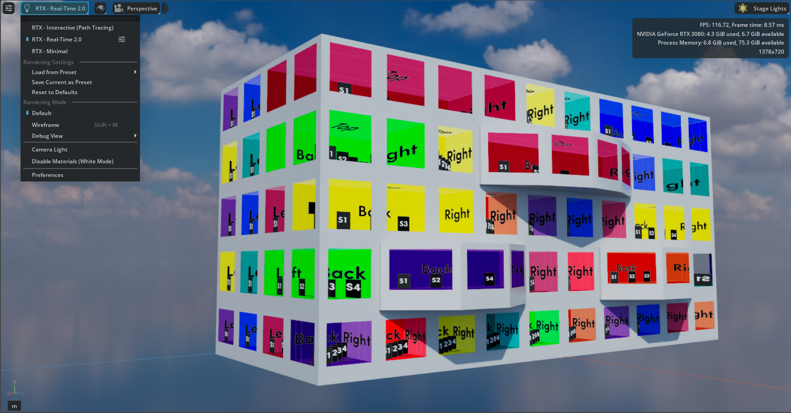
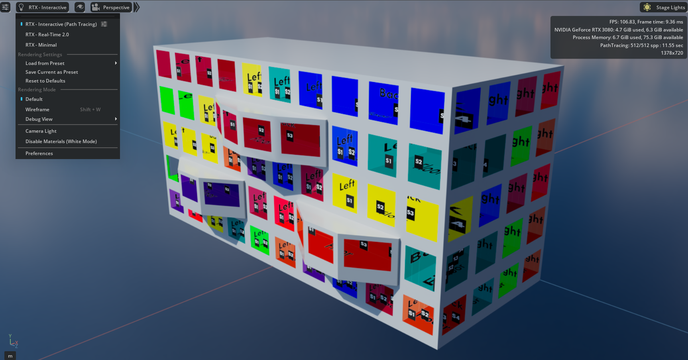
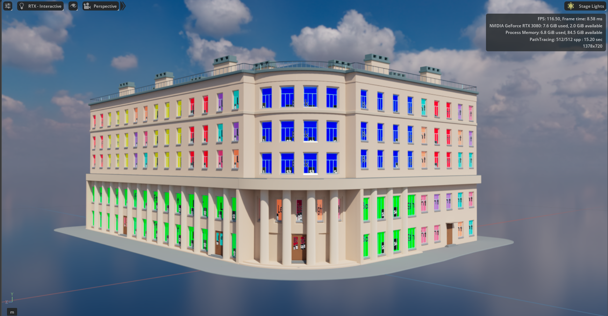
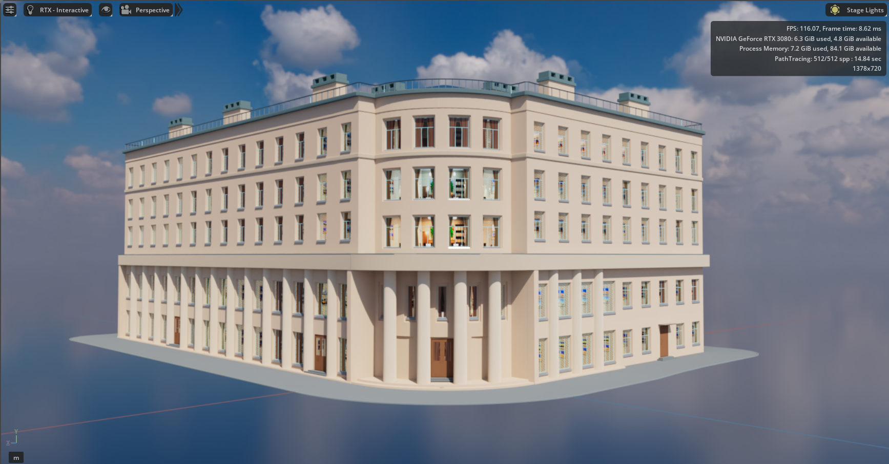
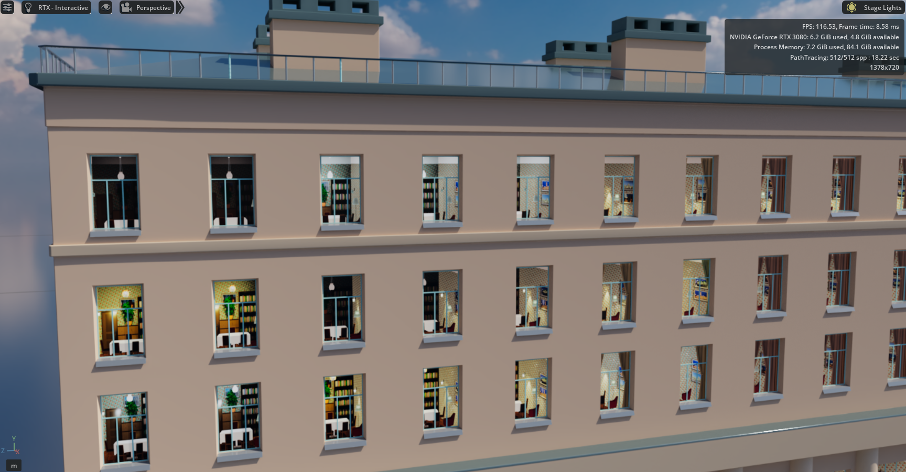
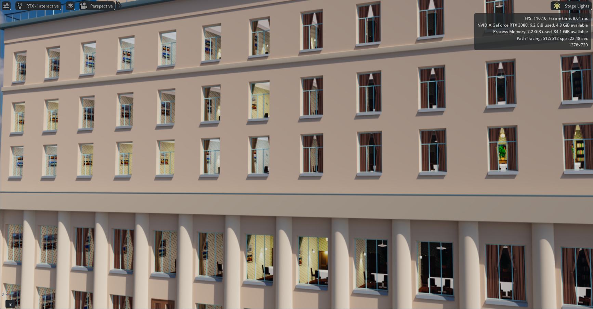
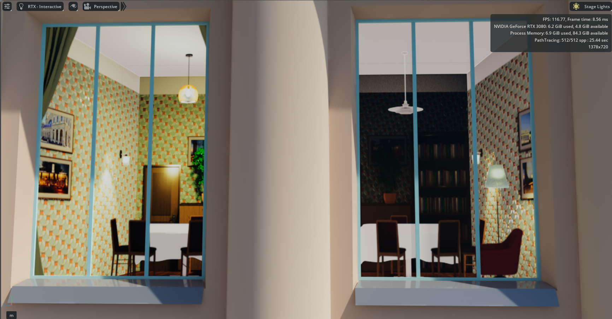
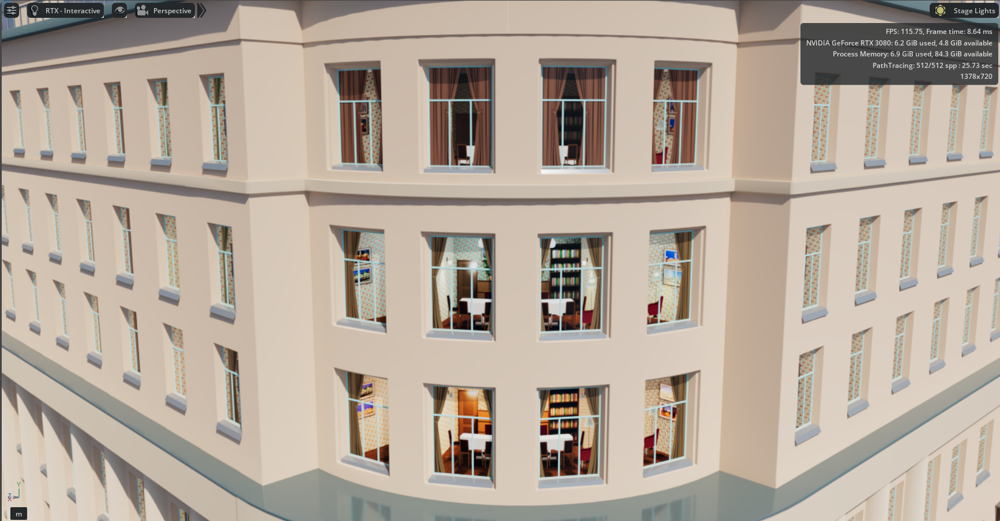

# Omniverse Room Map Shader for OpenUSD Digital Twins

> An installable NVIDIA Omniverse Kit extension for scalable parallax interiors

**Status**: `msp.orms.runtime` 1.0.20 is the current Registry build. Version
1.0.20 updates only the Extension Manager artwork and retains the 1.0.19
runtime. Ordinary authorable USD meshes retain full x1–x4 room classification,
while preserved native instances use a source-safe x1 `room_map_single` path
with the same four S1–S4 depth slices and applicable material controls.
Installed validation in RTX Real-Time and RTX Interactive covers the
multi-block city scene, moving-camera parallax, unchanged non-window materials,
and frozen/resumable lifecycle operation. The ordinary Production/Debug Apply
round trip is accepted; native Apply and the remaining Phase-5 matrix are still
open. Full native x2–x4 grouping and controlled performance evidence remain
separate work.

**Project shorthand: ORMS — Omniverse Room Map Shader**

**ORMS (Omniverse Room Map Shader)** is delivered as the installable
`msp.orms.runtime` Kit extension around the OpenUSD / NVIDIA MDL implementation
described below. The underlying technique — Parallax Interior Mapping (PIM) —
is well established and predates this project.

Once installed, ORMS is enabled and configured through the ordinary Kit user
interface. It does not require users to copy Python into Script Editor or add
`--ext-folder` and `--enable` arguments to every application launch.

---

## The Problem

Urban digital twins face a fundamental visual challenge: **believable building
interiors at scale**.

A technically detailed city can still feel lifeless at street level when
hundreds of windows resolve to identical reflections, black glazing, simple
curtain textures, or another repetitive façade treatment. Each visible room
could instead contain furniture, wall art, lighting, and props, but that creates
a trade-off between visual detail, authoring effort, scene complexity, storage,
asset management, and potentially rendering cost:

- **Full interior geometry**: Hundreds of visible rooms can require thousands
  of placed furniture and prop instances, even when the asset library is
  efficiently instanced.
- **Black windows**: Cheap to render, but visibly break immersion.
- **Reflection-only or curtain fallbacks**: Acceptable from a distance, but
  unconvincing at street level.

> **How can a city-scale digital twin gain believable visible interiors without
> requiring full physical room geometry behind every window?**

The rendering technique already exists. The research problem is carrying it
cleanly through an artist-facing OpenUSD and NVIDIA MDL workflow.

---

## The Solution: Parallax Interior Mapping

**Parallax Interior Mapping (PIM)** renders interiors into specialised textures,
then uses shader mathematics to create a convincing 3D illusion. It is a
well-established technique for producing view-dependent depth perception from
2D data.

**Project overview:** [Watch the video on YouTube](https://youtu.be/O5fqQwg8EVs) ·
[Read the project post on LinkedIn](https://lnkd.in/p/dcsmea8N)

**How it works:**

1. Bake an interior into a cross-shaped atlas containing the room faces and
   optional depth slices.
2. Precompute a local coordinate frame for each window.
3. Use the camera direction in the material to select the correct atlas region
   and create view-dependent parallax.

**The intended production result**: large numbers of visually varied virtual
interiors evaluated on existing window surfaces rather than modelled as full
interior geometry.

**The challenge**: Build an artist-facing PIM material that carries the required
room-frame and camera data through OpenUSD, then evaluates the illusion
efficiently in NVIDIA MDL.

---

## This Research: Parallax Interior Mapping in MDL/OpenUSD

**Goal**: Develop ORMS as a native PIM material and artist-facing workflow for
NVIDIA MDL and OpenUSD, enabling Omniverse-based digital twins to use apparent
interiors without requiring every visible room to exist as full geometry.

**Why this matters:**

- **For Digital Twins**: Scalable urban interiors with reduced geometry and scene-complexity requirements
- **For NVIDIA**: Demonstrates MDL and OpenUSD capability for an advanced, artist-facing material workflow
- **For the industry**: Cross-DCC interoperability — workflows shouldn't be siloed by renderer choice

> [!NOTE]
> **On Technique vs. Implementation**
>
> **Parallax interior mapping** is a well-established rendering technique used across game engines (Unreal, Unity), shading languages (OSL, GLSL), and DCC tools. SideFX's Karma Room Map is an important VEX-based reference implementation, not the origin of the underlying algorithm.
>
> This research develops a native PIM implementation for MDL and OpenUSD. The SideFX workflow informs the reference geometry, frame-data, and atlas contracts; it is not copied or directly translated.
>
> No readily available public Omniverse/MDL Room Mapping implementation was
> found during this project's research. This is not a claim that ORMS is the
> first implementation of the technique in Omniverse or elsewhere.
>
> Credit to SideFX for their excellent documentation and implementation, which serve as an important reference for this work.

---

## Where ORMS Fits in an Urban Digital Twin

A city-scale digital twin may need several representations of the same building
depending on viewing distance, task, and simulation requirements:

```text
City massing
    ↓
Detailed exterior / façade
    ↓
Detailed façade + ORMS apparent interiors
    ↓
Full physical interior geometry where required
```

This is an illustrative representation hierarchy, not an official CityGML,
OpenUSD, or NVIDIA LOD specification. ORMS occupies the space between an
exterior-only building and a fully modelled interior: it adds believable
apparent depth and variation where the camera remains outside, while physical
geometry remains available wherever the rooms themselves matter.

## Relevant Urban Digital Twin Use Cases

| Digital-twin context | Where ORMS can add value |
| --- | --- |
| Urban planning and masterplanning | Street- and neighbourhood-scale reviews where façade realism matters but users do not need to enter every room. |
| Smart-city operational visualisation | A more believable inhabited context for traffic, transit, sensor, CCTV, utility, flood, and public-space dashboards whose operational data is not room topology. |
| Transportation, pedestrian, and logistics twins | Street-level context for roads, deliveries, public transit, curbside operations, and outdoor pedestrian flows. |
| Geospatial and GIS city twins | An apparent-interior layer for photogrammetry, procedural cities, 3D Tiles, and aggregated OpenUSD buildings that otherwise end at flat glazing. |
| Architecture and real estate | Exterior neighbourhood walkthroughs where modelling hundreds of secondary interiors would add little functional value. |
| Public communication | Planning reviews, exhibitions, consultations, executive demonstrations, and presentation material where visual plausibility supports comprehension. |
| Exterior-focused simulation | A presentation layer around urban airflow, flooding, traffic, outdoor sensor, or telecom visualisation. ORMS must remain separate from the physical simulation ground truth. |

## Where ORMS Is Not a Substitute for Geometry

**ORMS is a visual representation technique, not a substitute for physical
interior geometry when that geometry participates in simulation, navigation,
collision, engineering analysis, or operational state.**

Physical interiors remain necessary for indoor robotics and navigation;
evacuation and indoor pedestrian simulation; CFD and HVAC analysis; RF and
wireless propagation; BIM/FM workflows that require rooms and equipment;
interior collision or physics; physically correct sensor simulation; and any
workflow where walls, doors, furniture, or internal topology are simulation
inputs rather than presentation content.

---

## Visual Baseline and Transformation Path

This RnD begins with a digital replica of Building 150 on Moskovsky Avenue in
Saint Petersburg, prepared as a USD asset for Omniverse. As the screenshot
shows, its windows currently read as identical mirror-like polygons that do
little more than repeat the surrounding HDRI reflection across the facade. The
result is mechanically uniform: every opening responds in much the same way,
with no suggestion of the spaces or activity behind the glass.

The goal of this RnD remains to create a native MDL Room Map material and carry
it through to production applicability. The renderer-validated technical core
now establishes the material, OpenUSD data contract, runtime classification,
and retained DCC-to-Omniverse evidence. That result has been applied to the
real Building 150 asset: ORMS replaces the repetitive mirrored-window baseline
with view-dependent interiors while preserving the building's non-window
materials and avoiding physical geometry for every room.


*Starting asset: the Omniverse USD building before room-frame data, MDL
parallax mapping, and interior variation are introduced.*

### First MDL Parallax Proof

The first functional MDL vertical slice uses a one-by-one test window to sample
a labelled cross-atlas and form a view-dependent virtual room. The diagnostic
texture makes every face assignment readable, while the applied material views
show how the visible walls change as the camera moves.

| Baseline test plane | Diagnostic cross-atlas |
| --- | --- |
|  |  |

*The diagnostic cross-atlas defines the five virtual room faces. S1–S4 are
reserved depth-slice markers and are not sampled by this first vertical slice.*

| Head-on room view | Oblique room view |
| --- | --- |
|  |  |

*The changing visible faces demonstrate the parallax response while the
labelled atlas exposes any incorrect face assignment or orientation.*

### MDL Depth-Slice Proof

The public `room_map` material extends the five-face room with four
alpha-composited virtual planes. The green diagnostic atlas separates this
validation from the red single-room baseline: S1–S4 are sampled from the four
corner regions and positioned by editable percentages of room depth.

| Depth-slice test room | Depth-slice diagnostic cross-atlas |
| --- | --- |
|  |  |

*The green cross-atlas retains the five room faces and uses its four corner
regions as alpha-capable S1–S4 slice tiles.*

| Oblique RTX Real-Time view | Oblique RTX Interactive (Path Tracing) view |
| --- | --- |
|  |  |

*The changing camera angle exposes the virtual depth planes. The material
sorts their alpha contribution by edited geometric depth, rather than by fixed
S1–S4 order.*

### Deterministic Room Variation Across Omniverse-Authored and DCC-Exported Geometry

The following completed stage stored three diagnostic interiors in one UDIM
sequence and selected them inside MDL from an integer `roomID` and
material-level seed.
Disconnected windows carrying the same identifier retain the same green, red,
or blue room without requiring separate material bindings.

| Omniverse-authored test scene — RTX Real-Time | Omniverse-authored test scene — RTX Interactive |
| --- | --- |
|  |  |

*The six grids created for the Omniverse test scene make repeated `roomID`
pairs directly comparable, while the labelled faces and S1–S4 slices expose
orientation or tile-selection errors.*

The second scene uses 15-window test geometry exported through a standard
OpenUSD workflow. Houdini is the specific DCC used for this retained asset and
procedurally authors a dedicated `roomUV` primvar. The model's ordinary UV
layout remains independent from the Room Map projection.

| DCC-exported test geometry — RTX Real-Time | DCC-exported test geometry — RTX Interactive |
| --- | --- |
|  |  |

*The facade keeps its original material while one shared MDL material drives
all windows. Spatially separated windows with the same `roomID` remain
visually consistent in both RTX renderers.*

### Runtime-Classified Shared Rooms on a Houdini-Exported Building

The runtime classifier derives neighbouring windows directly from the composed
OpenUSD stage and maps each supported group into one coherent x1-x4 virtual
room. The retained Houdini-derived fixture combines flat runs, different
aperture sizes, faceted bays, a fully angled bay, and bounded 90-degree corners
without rewriting the source building asset.

| Shared-room fixture — RTX Real-Time | Shared-room fixture — RTX Interactive |
| --- | --- |
|  |  |

*The labelled debug interiors expose room-family selection, wall orientation,
depth slices, and deterministic variation in one overview. Flat windows,
faceted bays, and right-angle facade turns retain one continuous room
perspective in both RTX renderer modes.*

### Five Interior Sets: Diagnostic Assignment to Production Interiors

KRM-92 extends the same global classifier from one atlas and material profile
to five selector-driven Interior Sets. The forced-debug view makes the Set and
room-family assignments readable across the complete building; the production
view replaces those diagnostic atlases with the independently configured room
libraries without changing the source USD asset.

| Forced packaged-debug assignment | Production Interior Sets |
| --- | --- |
|  |  |

*The two overview states use the same classified windows and shared-room
layout. Debug mode exposes routing and x1-x4 family selection; production mode
shows the artist-facing result.*

| Production facade overview | Production oblique facade view |
| --- | --- |
|  |  |

*Distinct room libraries remain visually legible across repeated windows while
one runtime preserves the shared classifier, stable Set identities, and
source-safe Session Layer ownership.*

| Near-field production rooms | Shared rooms around a curved facade |
| --- | --- |
|  |  |

*The retained close views expose the parallax depth, depth-slice furnishing,
curtains, lighting, and cross-window room continuity that replace physical
interior geometry. The visible performance HUD records this validation session
only; it is not a substitute for the planned controlled benchmark.*

### Current Validated Boundary

#### Validated now

- A common centred virtual-room scale across square `1 × 1`, landscape `2 × 1`,
  and portrait `1 × 2` windows in Omniverse-authored and Houdini-exported
  test assets.
- Five virtual room faces: Back, Left, Right, Ceiling, and Floor.
- Four alpha-composited virtual depth slices: S1, S2, S3, and S4.
- Named USD frame primvars: `roomP`, `tangentu`, and `tangentv`.
- Dedicated face-varying `roomUV` coordinates that do not replace the model's
  ordinary UV layout.
- Eight deterministic UDIM room variants selected from `roomID` and
  `variation_seed` through one material binding.
- Active-camera runtime bridge and cross-atlas mapping.
- Editable uniform room scale plus aperture scale and offset controls.
- Editable per-slice enable, depth, offset, and scale controls.
- Correct face assignment, orientation, and depth sorting in RTX Real-Time and
  RTX Interactive (Path Tracing).
- Shared coherent room volumes across automatically classified flat, bay, and
  right-angle window groups in both Omniverse-authored and Houdini-exported
  validation fixtures.
- Production validation on all 232 Building 150 window apertures with adaptive
  floor- and façade-local classification across x1–x4 families while retaining
  the source asset and every non-window material binding.
- Independent per-Interior-Set material profiles, including one-surface glass
  roughness, reflectivity, tint, and artistic transmission controls.
- Five selector-driven Interior Sets on Building 150, each with independent
  production x1–x4 atlas locations and global packaged-debug fallbacks.
- Luminance-selected interior emission with threshold, softness, strength, and
  independent depth-slice eligibility, validated in both RTX renderer modes.
- Installable `msp.orms.runtime` 1.0.16 packaging, publication, installation,
  enablement, and AUTOLOAD through a local Kit extension registry.
- Selector-driven automatic assignment with an editable `Windows_Glass`
  default, exact window-only bindings, and complete source restoration.
- Full x1–x4 assignment on ordinary authorable meshes and preserved-native x1
  assignment through removable class-local materials, without de-instancing,
  generated sidecars, reference replacement, or stage reopening.
- Material Library creation and manual binding without Script Editor code.
- A dockable `Window > ORMS` panel with lifecycle controls, per-Set material
  parameters, staged repeatable Interior Set blocks, debug/production mode,
  and portable `.orms` scene profiles.
- One-click opening of the bundled Building 150 demo scene, with an automatic
  relative-path demo profile on a factory-clean first run.
- `Stop` freezing the current parallax result, `Start` and `Restart` resuming
  live camera updates, and `Restore Original Asset` revealing the unchanged
  source bindings in both supported RTX modes.
- Version-aware in-process extension upgrades through 1.0.16, including
  installed-package provenance and source-integrity diagnostics.

#### Remaining boundaries

- Optional ORMS 2.0 glass contamination and parallax art-direction controls.
- A geometry-versus-Room-Map performance benchmark.

---

## Extension Architecture

The Kit extension is the product boundary; shader maths, OpenUSD
classification, runtime state, resource resolution, and UI wiring remain
separate implementation zones:

```text
Extension Manager / AUTOLOAD
    -> extension.py                 minimal Kit entry point
       -> service.py                lifecycle and stage coordination
          -> materials/             MDL + Material Library registration
          -> assignments/           reversible Windows_Glass assignment
          -> interior_sets/         staged configuration and resolution
           -> lifecycle state machine
              -> shared-room classifier and anonymous runtime overlays
              -> ordinary and preserved-native camera bridges
          -> ui/                     Window > ORMS and its three settings tabs
```

| Component | Responsibility |
| --- | --- |
| `extension.py` | Starts and stops the extension without owning runtime logic. |
| `service.py` | Coordinates stage events, assignment, lifecycle, settings, startup, and teardown. |
| `lifecycle.py` | Owns the `Inactive`, `Running`, `Stopped`, and `Failed` state transitions. |
| `runtime/assignments/` | Owns automatic mesh-assignment inspection, overrides, and presentation. |
| `runtime/interior_sets/` | Owns staged set configuration, persistence, transactions, and atlas resolution. |
| `runtime/profiles/` | Owns portable `.orms` profiles and their save/load workflow. |
| `runtime/materials/` | Owns MDL registration, atlas manifests, Material Library integration, and update feedback. |
| `runtime/ui/` | Owns the dockable `Window > ORMS` shell and artist-facing controls. |
| `msp/orms/shared_room/settings_panel.py` | Builds the classifier, material, and atlas controls embedded in that shell. |
| `msp/orms/shared_room/material_controls.py` | Defines the single persistent artist value for every shared shader control. |
| `runtime/resources.py` | Resolves canonical MDL, packaged debug atlases, and external production families. |
| `msp/orms/scene/source_loader.py` | Reloads the exact extension-owned runtime graph and cleans up live callback owners. |
| `msp/orms/scene/assignment.py` | Validates compatible window meshes and owns reversible default bindings. |
| `msp/orms/classification/` | Performs deterministic, Kit-independent x1–x4 room classification. |
| `msp/orms/shared_room/` | Interprets composed OpenUSD and authors ordinary x1–x4 state or preserved-native x1 overlays in ORMS-owned anonymous layers. |

ORMs runtime opinions exist only in ORMS-owned anonymous Session Layer
sublayers. Ordinary meshes receive exact Mesh or GeomSubset bindings and full
x1–x4 classification. Preserved native instances keep their instanceability;
eligible window descendants receive removable overlays on an existing source
class and class-local `room_map_single` materials. No binding is broadened to a
building root. Removing the runtime layers reveals the original composition
without rewriting source USD files. Common material parameters are presented
once in the ORMS window and distributed to both routes.

---

## Install and Use the Kit Extension

The currently accepted distribution path is a local filesystem Kit registry.
Publishing and installation are separate responsibilities.

### Publish to the Registry — Developer or Distributor

The registry owner publishes the standalone extension from this repository
into a configured Kit App Template registry:

```powershell
python tools/publish_orms_local_registry.py `
    --kit-app-root E:\path\to\kit-app-template
```

This is a release operation. Artists installing ORMS from an already
configured registry do not run the publication script.

### Install and Run — Artist or Extension User

Once the application is connected to a registry containing ORMS, use the
normal Kit workflow:

1. Launch the application normally; for a Kit App Template checkout, use
   `./repo.sh launch` on Linux or `.\repo.bat launch` on Windows.
2. Open `Window > Extensions` and find `Omniverse Room Map Shader`.
3. Select `Install`, enable the extension, and select `AUTOLOAD`.
4. On later launches, start the Kit application normally. ORMS is discovered
   from the registry and starts without repository-specific command-line
   arguments.

Open `Window > ORMS` to access lifecycle controls and the `ORMS Classifier`,
`Material Parameters`, and `Interior Atlases` tabs. Compatible
window meshes selected by the editable Interior Set masks are assigned
automatically; the Default Set starts with `Windows_Glass`. The same material
remains available for manual assignment through
`Create > Material > ORMS > Omniverse Room Map Shader`.

`Start` activates an eligible stage. `Stop` retains the current ORMS image and
freezes camera-driven parallax updates. `Start` or `Restart` resumes a stopped
runtime, while `Restore Original Asset` removes ORMS-owned runtime layers and
reveals the source material bindings. Disabling the extension performs the
same source-safe teardown.

The installed package contains public x1–x4 debug atlases. Production atlases
remain external content and are selected independently for each room family in
the `Interior Atlases` tab.

The repository stores its bundled demo binaries with Git LFS. Source users
should install Git LFS before cloning, or run `git lfs install` followed by
`git lfs pull` in an existing checkout. For GitHub-generated ZIP downloads,
the repository owner must enable **Include Git LFS objects in archives**;
otherwise the archive can contain LFS pointer files instead of the demo
assets.

For package construction and local-registry administration, see the
[extension README](exts/msp.orms.runtime/README.md).

---

## Upstream Room Map Content Factory

The material-side R&D is complemented by an existing Houdini content-generation
workflow. A procedural Solaris / Karma XPU / PDG / Copernicus pipeline can
generate Room Map libraries by varying wallpaper, lighting, curtains, props,
and depth-slice content. This content factory is a separate upstream authoring
system, not part of the MDL shader itself. Building 150 now exercises five
selector-driven production libraries across x1–x4 room sizes, while packaged
labelled debug families remain available as a global diagnostic mode and
per-family fallback. The five local production libraries publish versioned
semantic variant manifests with aligned x1-x4 identity sequences.

## Production Validation Path

The technical R&D core, production-building integration, installable Kit
extension, KRM-92 artist workflow, and first urban digital-twin deployment are
implemented. Controlled performance evidence remains a separate validation
stage.

### Stage 1: Building 150 Integration — Complete

1. Applied the ORMS material contract to the real Building 150 USD asset
   without modifying its source layers.
2. Validated all 232 window apertures, hierarchy, orientation, adaptive room
   grouping, and material-binding isolation.
3. Integrated the 56-variant real x1 atlas and retained correctly bounded debug
   families for x2–x4 until their real content exists.
4. Added independent one-surface glass and luminance-selected emission without
   breaking the PIM result or increasing its five-lookup budget.
5. Accepted exterior camera motion and both RTX renderer modes with stable room
   identity, parallax, reflections, and source materials.
6. Retained the fixed Building 150 fixture for a future performance benchmark;
   no geometry-versus-ORMS result is claimed by this integration milestone.

### Stage 2: Urban Digital-Twin Scale — Implemented

1. Applied ORMS to nine compatible building prototypes in the production city.
2. Assembled the prototypes across multiple city blocks while preserving the
   native-instance composition.
3. Validated exact window-only assignment, original non-window materials,
   moving-camera parallax, S1–S4 depth slices, and lifecycle recovery in RTX
   Real-Time and RTX Interactive.
4. Kept the original Houdini/USD layers unchanged and avoided sidecars,
   reference substitution, stage reopening, and geometry de-instancing.

### Stage 3: Controlled Performance Evidence — Planned

Measure the geometry-versus-ORMS trade-off at representative building, street,
and neighbourhood viewpoints. No comparative performance result is claimed by
the city-scale implementation milestone.

---

## Technical Challenge: Native MDL/OpenUSD Implementation

The SideFX reference workflow and this native MDL/OpenUSD implementation meet
different geometry, material, and runtime constraints:

### 1. **Room Frame Data in MDL**

Houdini exports `roomP`, `tangentu`, and `tangentv` as named USD `float3`
primvars. The validated MDL material reads them with
`nvidia::support_definitions::data_lookup_float3()` and constructs the local
room frame from the exported data. A separate face-varying `roomUV` primvar
provides normalised window coordinates without replacing the model's ordinary
packed UV layout.

`nvidia::support_definitions` is an Omniverse-specific dependency of this
implementation. The named-primvar path has been visually validated in RTX
Real-Time and RTX Interactive (Path Tracing); the detailed evidence is in the
[primvar access diagnostic](docs/knowledge_base/mdl/004_primvar_access.md).

This named-primvar route is the current validated production contract. Dynamic
frame construction for environments without the NVIDIA support definitions
module remains a possible compatibility path, not a demonstrated capability.

---

### 2. **Camera Position Runtime Bridge**

`state::direction()` was tested and does not provide the material view direction
required for PIM. Instead, `msp/orms/scene/camera_position_bridge.py`
obtains the active Kit or Composer camera world position and writes it to the
`camera_position_world` material input in the USD **Session Layer**. Camera
motion therefore does not become a permanent edit to the source USD scene.

The diagnostic view vector is
`camera_position_world - surface_position_world`. The PIM material
transforms both positions into the room frame before constructing its ray. See
the [state-function diagnostics](docs/knowledge_base/mdl/002_state_functions.md)
and [camera bridge contract](docs/knowledge_base/mdl/003_camera_position_bridge.md)
for the detailed validation record.

---

### 3. **First Five-Face Analytic Parallax Baseline**

The retained `room_map_single.mdl` proof established the single-room analytic
projection:

1. Construct the local room frame from `roomP`, `tangentu`, and `tangentv`.
2. Transform camera and surface positions into that room frame.
3. Build the view ray through the window.
4. Intersect the ray with the Back, Left, Right, Ceiling, and Floor planes.
5. Select the nearest positive intersection.
6. Convert the hit point into the corresponding cross-atlas region.
7. Sample that region with `tex::lookup_float4()`.

The historical baseline used one atlas lookup and had no depth-slice
composition. The current native `Preserve/x1` runtime keeps this same
single-room grouping and analytic trace, then adds the four bounded S1-S4
lookups described below. `x1` describes room grouping; it does not disable
layered depth.

---

### 4. **Validated Depth-Slice Extension**

`room_map.mdl` retains the five-face analytic trace, then intersects the same
view ray with up to four slice planes. Each plane is positioned from zero per
cent at the window to one hundred per cent at the back wall, samples its
corresponding S1–S4 atlas corner, and alpha-composites over the room result.
The contribution order follows the edited geometric depths, so artists can
reorder slices without changing their S1–S4 identifiers.

The prototype exposes enable, depth, offset, and scale controls for each slice
and has been visually validated in RTX Real-Time and RTX Interactive (Path
Tracing). See the [depth-slice contract](docs/knowledge_base/mdl/006_depth_slices.md)
for its parameter and validation boundary.

---

### 5. **Deterministic UDIM Room Variation**

The public `room_map.mdl` material reads an integer `roomID`, combines it with
`variation_seed`, and selects one complete interior from a tiled UDIM atlas.
Disconnected windows with the same identifier receive the same room, while a
seed change redistributes the variants without adding per-window materials or
texture lookups.

The six-grid Omniverse-authored scene proves the selection logic. The
15-window DCC-exported scene proves that `roomID`, the room frame, and the
dedicated `roomUV` coordinates survive the authored USD workflow. See the
[room-variant contract](docs/knowledge_base/mdl/007_room_variants.md) for the
mapping, export requirements, and retained validation scenes.

---

### 6. **Window Aperture Scale and Offset Controls**

KRM-94 separates the physical aperture from the centred virtual room. Square,
landscape, and portrait windows therefore retain one stable room scale while
artist-facing aperture scale and offset controls describe how each opening
reveals that room. The accepted contract preserves the five room faces, depth
slices, frame primvars, and ordinary mesh UVs in both Omniverse-authored and
Houdini-exported geometry.

See the
[window-aperture contract](docs/knowledge_base/mdl/008_window_apertures.md) for
the parameter, coordinate-space, and renderer-validation record.

---

### 7. **Runtime-Classified Shared Rooms and USD Composition**

KRM-93 derives neighbouring apertures from the composed OpenUSD stage and maps
supported flat runs, rigid faceted bays, and bounded right-angle corners into
coherent x1–x4 virtual rooms on ordinary authorable meshes. The runtime authors
derived primvars and exact window bindings in ORMS-owned anonymous layers,
leaving the source USD asset unchanged. It also preserves deterministic room
variation, physical aperture controls, four depth slices, and stable camera
response.

The current runtime also covers Houdini-exported native-instance composition.
It discovers instance-proxy windows read-only, retains native instanceability,
and places a removable class-local `room_map_single` material only on the
eligible window descendant. That preserved-native route deliberately uses x1
room grouping while retaining S1–S4 depth slices, glass, emission, and live
camera parallax. Session de-instancing is historical evidence, not a current
product fallback; the runtime creates no adapter or sidecar stage.

See the
[shared-room contract](docs/knowledge_base/mdl/009_shared_multi_window_rooms.md)
for the classification, primvar, fallback, instancing, and renderer evidence.

---

### 8. **Production Kit Extension and Artist Workflow**

[`exts/msp.orms.runtime`](exts/msp.orms.runtime/) is now a standalone,
installable Kit extension rather than a manual runtime launcher. Its manifest,
Python package, MDL resources, public debug atlases, icons, changelog, and
Extension Manager documentation are materialised into one non-overwriting
release bundle and published through Kit's ordinary extension-registry flow.

Installed versions through 1.0.16 have exercised the local-registry workflow,
AUTOLOAD, Material Library creation, reversible automatic assignment, five
Interior Sets, independent x1–x4 ordinary material families, and source-safe
runtime ownership. Version 1.0.16 adds the preserved-native x1 route with
window-only class-local materials, S1–S4 depth slices, resumable frozen camera
updates, and clean restoration in RTX Real-Time and RTX Interactive.

The canonical module ownership and Session Layer flow are described once in
[Extension Architecture](#extension-architecture). This milestone section
records the installed result rather than repeating that architecture.

The [KRM-91 integration record](docs/knowledge_base/mdl/011_orms_kit_extension.md)
contains the architecture, failure history, and installed acceptance evidence.
The [KRM-92 delivery record](docs/knowledge_base/mdl/012_orms_ui_and_artist_workflow.md)
records the completed artist-facing implementation and installed acceptance
without reopening the accepted extension runtime.
The [runtime recovery and native-instance record](docs/knowledge_base/mdl/014_orms_runtime_recovery_and_native_instances.md)
records the current two-route contract, rejected approaches, and validation
boundary through 1.0.16.

---

### 9. **Geometry-versus-ORMS Performance Benchmark**

The final production argument requires measured evidence, not an assumed
performance claim. A controlled benchmark will compare ORMS against real or
representative instanced interior geometry using the same building assets,
camera path, renderer settings, and visual target. It will record GPU frame
time or FPS, VRAM, scene load time, USD prim or instance count, and practical
geometry statistics before the workflow is presented as a city-scale
optimisation.

The draft [geometry-versus-ORMS VRAM benchmark](docs/knowledge_base/mdl/013_geometry_vs_orms_vram_benchmark.md)
predicts approximately **15-34x lower texture residency for ORMS** under its
primary like-for-like assumptions. This is an unverified analytical hypothesis,
not an empirical performance result: it does not yet prove an equivalent FPS
gain, load-time reduction, or measured renderer-memory ratio.

---

## Research Progress

### Phase 1: Documentation & Analysis — Complete

The [Knowledge Base](docs/knowledge_base/) and ADRs document the SideFX
reference workflow, the PIM coordinate contract, and the native MDL/OpenUSD
implementation decisions.

### Phase 2: MDL / USD Integration Strategy — Validated

The validated integration contracts now include:

- Houdini-exported USD frame primvars.
- MDL named `float3` primvar lookup.
- Active-camera runtime bridge.
- Room-space view-ray construction.
- Cross-atlas face projection.
- Dedicated `roomUV` transport from DCC geometry.
- Deterministic `roomID`-to-UDIM variant selection.

### Phase 3: Renderer-Validated Technical Core — Complete

The renderer-validated implementation supports:

- A common centred virtual-room scale across square, landscape, and portrait
  windows in Omniverse-authored and Houdini-exported test geometry.
- Five virtual room faces and four alpha-composited S1–S4 depth slices.
- Editable slice depth, offset, and scale controls.
- Eight deterministic UDIM room variants shared by repeated `roomID` values.
- A dedicated `roomUV` export contract that leaves ordinary mesh UVs intact.
- View-dependent parallax in RTX Real-Time and RTX Interactive (Path Tracing).
- Automatic shared-room classification for flat, bay, and right-angle window
  groups without permanent edits to source USD assets.
- Physical aperture scale and offset controls across differing window sizes.
- Source-safe ordinary Session Layer bindings and preserved-native x1 class
  overlays, without de-instancing, generated sidecars, or source rewrites.
- Deterministic family fallback, central ORMS settings, and runtime lifecycle
  behaviour validated in retained Omniverse-authored and Houdini-exported
  fixtures and in the installed extension.
- Adaptive floor- and façade-local room classification on Building 150 with
  source-safe x1–x4 bindings and no building-specific spacing constant.
- Independent glass roughness, reflectivity, tint, and artistic transmission.
- A real 56-variant x1 atlas and luminance-selected emission with independent
  per-depth-slice eligibility in both required renderer modes.
- One classifier assigning five ordered Interior Sets before room grouping,
  with independent x1–x4 resources and material profiles per stable Set ID.
- Staged structural editing, live per-Set material controls, and portable
  `.orms` scene-profile save/load.

The remaining work no longer concerns the core PIM mathematics, the Kit
extension boundary, KRM-92, or the first urban-scale deployment. It concerns
formal acceptance accounting, controlled performance evidence, and later
research into full x2–x4 grouping for preserved native instances.

### Phase 4: Productionisation — In progress

The production phase has completed Building 150 integration, the installed Kit
extension boundary, and the first multi-block native-instance deployment. ORMS
now has repeatable packaging, local-registry publication, Extension Manager
installation, AUTOLOAD, configuration, diagnostics, and controlled lifecycle
behaviour. Its remaining scope is the formal installed acceptance/resource
matrix and the controlled geometry-versus-ORMS performance benchmark. Full
x2–x4 grouping for preserved native instances remains a later research target.

---

## Planned Performance Validation

This benchmark is planned; no performance result is claimed yet. ORMS is
designed to reduce the amount of physical interior geometry and scene
complexity required for exterior-facing urban visualisation. Building 150 is
the fixed test asset, with 232 validated window apertures. A conventional
reference will use procedurally distributed instanced proxy interior assets
whose geometry budgets are derived from representative real-time or low-poly
furniture assets. The PIM version will use the same building, camera path, and
render settings.

The comparison will record GPU frame time or FPS, VRAM, scene load time, and
USD prim or instance count, plus geometry statistics where practical.

---

## Repository Structure

```text
exts/msp.orms.runtime/              # Canonical source and installable package
├── config/extension.toml           # Kit package metadata
├── data/mdl/                       # Production and diagnostic MDL
└── msp/orms/
    ├── classification/             # Kit-independent x1–x4 classification
    ├── interior_sets/              # Set identity, selectors, and resources
    ├── scene/                      # Reusable stage and Kit infrastructure
    ├── shared_room/                # OpenUSD runtime authoring
    └── runtime/                    # Extension service and reload entry
        ├── assignments/            # Mesh-assignment overrides and UI
        ├── interior_sets/          # Transactional atlas configuration
        ├── materials/              # MDL and Material Library integration
        ├── profiles/               # Portable scene profiles
        └── ui/                     # Window shell and artist controls
tests/
├── kit_extension/                  # Extension and lifecycle seams
├── shared_room_runtime/            # Classifier and OpenUSD fixtures
└── building_150_runtime/           # Production-building integration fixture
docs/
├── adr/                            # Architecture decisions
├── img/                            # Retained visual evidence
└── knowledge_base/mdl/             # Ordered implementation records
tools/                              # Repository utilities only
├── mcp/                            # Local documentation clients
├── package_orms_extension.py       # Standalone package builder
└── publish_orms_local_registry.py  # Registry publication workflow
```

This is a directory inventory, not a second architecture specification. Module
ownership and runtime flow are defined in
[Extension Architecture](#extension-architecture). The manual reload entry
point remains a development tool rather than the user launch path.

**Key Documentation**:

- [Knowledge Base](docs/knowledge_base/) — Start here for context
- [ADRs](docs/adr/) — Design decisions and trade-offs

---

## Engineering Evidence

The project includes a renderer-validated MDL parallax implementation with five
room faces, four depth slices, deterministic UDIM variation, and coherent
virtual rooms shared across flat, bay, and right-angle window groups. The same
runtime contract is retained in isolated Omniverse-authored and Houdini-exported
fixtures. A dedicated `roomUV` contract preserves ordinary asset UVs, while the
runtime classifier derives shared-room mappings without permanent edits to
source USD assets. Building 150 production integration adds adaptive x1–x4
grouping, real x1 content, independent glass controls, and selective interior
emission. The production city extends the same contract to nine compatible
native building prototypes without de-instancing or changing non-window
materials. The system is packaged as an installable Kit extension with registry
installation, AUTOLOAD, Material Library integration, reversible automatic
assignment, central controls, external production-atlas routing, version-safe
upgrades, and symmetric teardown. Controlled performance evidence and full
native x2–x4 grouping remain separate boundaries.

The retained evidence demonstrates:

✅ **Cross-ecosystem thinking** — Relating a Houdini reference workflow to a native OpenUSD/MDL implementation
✅ **Technical depth** — MDL internals, USD primvars, shader optimisation
✅ **Problem-solving focus** — Digital Twin use case drives technical choices
✅ **Research methodology** — Documentation-first, validate assumptions, iterate

**Technical areas covered**:

- NVIDIA MDL shader development
- USD/Omniverse pipeline integration
- Houdini, OpenUSD, and Omniverse interoperability
- Technical documentation and knowledge synthesis

---

## Getting Started

**For artists and extension users**: In a Kit application already connected to
the ORMS registry, install `Omniverse Room Map Shader` through Extension
Manager, enable `AUTOLOAD`, and open `Window > ORMS`. Artists do not run the
registry publication tool. The complete workflow is described in
[Install and Use the Kit Extension](#install-and-use-the-kit-extension).

**For extension developers and distributors**: See the
[extension README](exts/msp.orms.runtime/README.md), the publication section
above, the
[KRM-91 integration record](docs/knowledge_base/mdl/011_orms_kit_extension.md),
and the [KRM-92 delivery record](docs/knowledge_base/mdl/012_orms_ui_and_artist_workflow.md).

**For shader and OpenUSD developers**: See the
[Knowledge Base](docs/knowledge_base/) for the technical contracts.

**For researchers**: Check `docs/adr/` for design rationale

**First parallax baseline**: Open `tests/test_room_map_single.usda` in USD
Composer and follow the
[single-room parallax contract](docs/knowledge_base/mdl/005_single_room_parallax.md).

**Retained multi-window proof**: Open
`tests/shared_room_runtime/test_room_map_shared_rooms_omniverse.usda` and follow the
[shared-room contract](docs/knowledge_base/mdl/009_shared_multi_window_rooms.md).

**Current production integration**: Follow the
[Building 150 integration record](docs/knowledge_base/mdl/010_building_150_integration.md)
for the external-asset boundary, fixture, renderer evidence, material controls,
and completed validation sequence.

---

## Licensing

ORMS uses a mixed-licence distribution boundary:

- software and technical documentation are open source under the MIT License;
- the packaged x1–x4 debug atlases are reusable under CC BY 4.0;
- the Building 150 scene and reduced eight-tile demo atlas are source-available
  under the MSP Asset Evaluation License 1.0, which permits non-commercial
  evaluation, education, demonstrations, and attributed portfolio renders but
  not commercial use or standalone asset redistribution;
- the bundled Poly Haven HDRI remains available under CC0 1.0; and
- full production atlases and Houdini authoring sources are not distributed.

See [`LICENSE.md`](LICENSE.md) for the exact path-by-path scope,
[`THIRD_PARTY_NOTICES.md`](THIRD_PARTY_NOTICES.md) for provenance, and the
texts and references in [`LICENSES/`](LICENSES/). Public repository access does
not change the separate terms applied to demo and third-party assets.

---

## 📜 Technical Stack

- **Python**: 3.12 (repository baseline and Kit 110.1.2 embedded runtime)
- **NVIDIA MDL**: Core shader language
- **USD**: 23.11+ minimum compatibility baseline (primvars, stage composition)
- **Houdini**: 20.0+ (VEX reference implementation and OpenUSD export)
- **NVIDIA Omniverse Kit**: 110.1.2 (custom Kit application, MDL runtime, and RTX validation)

**Development Tools**:

- Pre-commit hooks (source hygiene, Python formatting, security, and tests)
- pytest (validation framework)
- Git LFS (for binary assets, if needed)

---

## 💖 Support This Research

If you find this work valuable:

[](https://buymeacoffee.com/maxspell)

Your support funds:

- Continued parallax-interior mapping research
- Prototype shader development and testing
- Quality documentation and tutorials

---

## 📜 Changelog

* **Week of 7 September, 2026:** Productionised ORMS around Building 150 and the multi-block city with Registry installation, five selector-driven Interior Sets, portable profiles, and the recovered 1.0.16 ordinary x1–x4 and preserved-native x1/S1–S4 paths, retaining exact window-only bindings, resumable camera updates, and source-safe restoration in both RTX modes.
* **Week of 31 August, 2026:** Finalised the source-safe shared-room runtime for coherent x1–x4 rooms across flat, bay, and right-angle window groups, including stable camera response and retained referenced-instance fixtures.
* **Week of 24 August, 2026:** Extended the renderer-validated MDL parallax room from its named-primvar, camera-bridge, five-face, depth-slice, and UDIM baselines to automatically classified shared volumes across flat, bay, and right-angle Omniverse window groups.
* **Week of 17 August, 2026:** Re-inventoried the RnD workspace with Omniverse MCP reference helpers, updated validation and dependency configuration, and renewed the MDL and USD research baseline.
* **Week of 2 March, 2026:** Defined the hybrid USD primvar and dynamic-frame strategy, then formalised native MDL parallax-interior mapping, cross-layout projection, depth slices, instance variation, and surface integration.
* **Week of 16 February, 2026:** Refined the public project narrative, knowledge base, technical stack, support information, and privacy boundary for a clearer recruiter and engineer reading path.
* **Week of 9 February, 2026:** Added safer Jira-plan synchronisation and consolidated repository naming conventions for repeatable research delivery.
* **Week of 2 February, 2026:** Established the Room Map Shader RnD foundation with public research documentation, architecture decisions, isolated Python tooling, security guardrails, a test baseline, and reusable asset-hydration structure.


---

**Part of [NVIDIA Omniverse Showreel](https://github.com/MSP014/dt-omniverse-showreel-case01-msk)**
